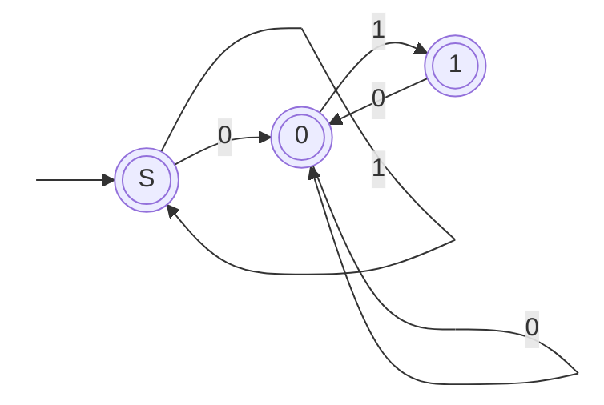

## Resolução

Pretende-se construir uma expressão regular que reconheça todas as strings binárias que **não contenham a substring `011`**.

### 1. Autómato

Para ajudar a raciocinar sobre o problema, foi construído um autómato que guarda o progresso de uma possível ocorrência de `011`:

* `S`: estado inicial, sem ocorrência de `011` em progresso;
* `0`: foi lido um `0`;
* `1`: foi lido `01`.



Todos os estados são finais. A única transição inexistente é `1 --1--> ?`, pois corresponderia a ler `011`, o que deve ser rejeitado.

A partir da estrutura do autómato, é possível identificar os padrões de string aceites:

* qualquer sequência de `1`'s no início (`1*`), pois nunca contribuem para `011`;
* seguida, opcionalmente, de um bloco que começa com `0`, pode repetir `0` ou `10` (sem nunca completar `011`), e pode terminar com um `1` isolado.

### 2. Expressão regular obtida

**Expressão regular:**

> `^1*(0(0|10)*1?)?$`

### 3. Verificação

Para verificar a expressão regular, foi criado um pequeno programa em Python (ficheiro [`test.py`](./test.py)) que testa todas as strings binárias até um determinado comprimento, comparando o resultado da expressão com a definição da linguagem (ausência da substring `011`).

Para os exemplos fornecidos, obtém-se:

```text
011011: rejeitada
10111: rejeitada
1101: aceite
101010: aceite
```

### 4. Conclusão

A expressão regular `^1*(0(0|10)*1?)?$` reconhece exatamente as strings binárias que não contêm a substring `011`.